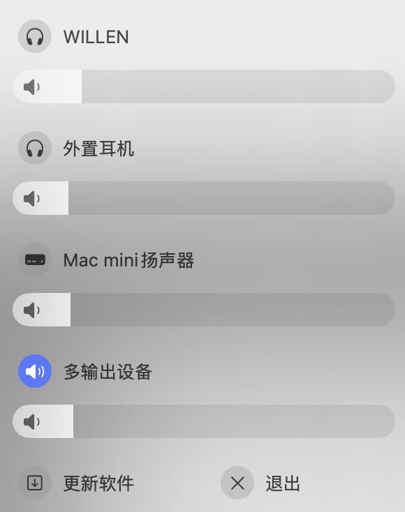

<h3></h3>

A simple and efficient tool to control the volume of macOS output devices, including aggregate devices, which the native volume controller cannot adjust.

  

 
 

 

## Download

Go to [Releases](https://github.com/achjqz/SoundChanger/releases) and download the latest `.dmg`

## Major features

- Change the volume of macOS output devices: Easily control the volume of individual sound output devices on your system.
- Support for multi-output devices: Adjust the volume for aggregate or multiple output devices simultaneously.
- Switch between output devices: Quickly change the current active output device with just a few clicks.
- Native macOS-style interface: Seamlessly integrates with macOS, offering an intuitive and familiar user experience.
- **One of the best app of its kind, completely FREE.**

## TODO
- [ ] Media keys support
- [ ] Set to launch at startup

## License

This project is licensed under the Apache License 2.0 - see the [LICENSE](LICENSE) file for details.
